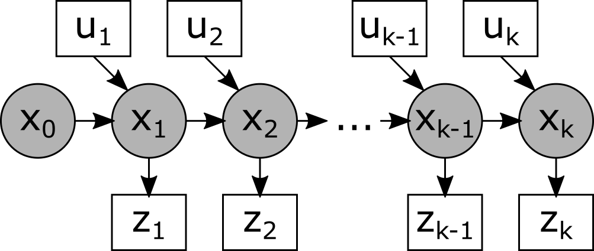

# About

Documentation (maybe later code) to better understand the Kalman filter. Questions in particular:

- What is the relationship between a Kalman filter and the Bayes filter
- Why is the Kalman gain calculated the way it is?
- How does the EKF and UKF work?
- How does a particle filter differ from the Kalman filter?

## Bayes filter

The Kalman filter is a special type of Bayes filter, so we start defining the Bayes filter first. The following information is mainly taken from https://en.wikipedia.org/wiki/Recursive_Bayesian_estimation.  

#### What is the Bayes filter?

> [The bayes filter] is a general probabilistic approach for estimating an unknown probability density function [of a system state] recursively over time.  [It uses]  (1) incoming [imperfect] measurements and (2) a mathematical process model.

In other words, the Bayes filter can be used to estimate a system state. Therefore, it uses (1) some kind of system-dependent measurements and (2) a system model. In order to that, the Bayes-filter assumes that the (unobservable) system state $x$ can be modeled by a Markov process and that the measurements $z$ are observations of this hidden Markov process (see image below).

The Markov property says that each state only depends on the previous state (and NOT the ones before!), so the probability of the state $x_k$ and the measurement $z_k$ can be expressed as

$$
\begin{aligned}
p(x_k|x_{k-1},x_{k-2}, ... ,x_0) &= p(x_k|x_{k-1}) \\
p(z_k|x_k, x_{k-1}, ... ,x_0) &= p(z_k|x_k) \\
\Rightarrow p(x_k, x_{k-1}, ... x_0, z_k, z_{k-1}, ... z_0)
&= p(x_0) \prod_{i=1}^{k}p(z_i|x_i)p(x_i|x_{i-1})
\\
\end{aligned}
$$

As you can see, the Bayes filter depends on two conditional probability models, namely ...

1. ... the measurement model $p(z_i|x_i)$, which tells us what measurement value we can expect given a certain system state and
2. ... the system model $p(x_i|x_{i-1})$, which tells us how the system evolves over time given an initial system state.

We have to mathematically define both models in order to be able to apply the Bayes filter! On the other hand, any mathematically definable model can be dealt with using a Bayes filter, see some examples in the table below.

| System description   | system model               | measurement model                       |
| -------------------- | -------------------------- | --------------------------------------- |
| car position         | movement of car over time  | position --> inaccurate GPS measurement |
| battery charge level | self-discharge over time   | charge level --> voltage                |
| daily weather        | weather dynamics over time | weather --> Clothes people wear         |

#### How to perform estimation?

So how do we estimate the system state $x_k$ given (1)  the measurements $z_1, z_2, ... z_{k-1}$ as well as (2) the measurement and the system model ? Let's start from the very beginning, where we don't have any measurements yet, but only $x_0$ (this has to be defined, in the simplest case as constant!). In this case, we can **predict** the next system state in a very simple way according to the [law of total probability](https://en.wikipedia.org/wiki/Law_of_total_probability):
$$
\begin{aligned}
p(x_1) =& \int p(x_1|x_0)p(x_0)dx_0\\
\\
& p(x_1|x_0) \text{ can be computed using system model} \\
& p(x_0) \text{ is known} \\
\end{aligned}
$$

Next, we receive the measurement $z_1$. Based on this measurement, we can **update** our estimate for $x_1$ via
$$
\begin{aligned}
p(x_1|z_1) =& \frac{p(z_1|x_1)p(x_1)}{p(z_1)}  \\
\\
& p(z_1|x_1) \text{ can be computed using measurement model} \\
& p(x_1) \text{ is known from previous oprediction step} \\
& p(z_1) \text{ is a normalization term independent of $x_1$} \\
\end{aligned}
$$

The normalization term $p(z_1)$ only serves to ensure that the probability density function adds up to one, i. e.  $\int p(x_1|z_1) dx_1 =1$.  It can be computed via
$$
\begin{align}
1 =& \int p(x_1|z_1) dx_1 \\
=& \int \frac{p(z_1|x_1)p(x_1)}{p(z_1)} dx_1 \\
=& \frac{1}{p(z_1)} \int p(z_1|x_1)p(x_1) dx_1 \\
\Leftrightarrow p(z_1)=&\int p(z_1|x_1)p(x_1) dx_1 
\end{align}
$$

These two steps, prediction step and update step, can be applied to estimate all following states $x_k$ as well. For time $k=2$ , the **prediction step** simply becomes
$$
\begin{aligned}
p(x_2| z_1) =& \int p(x_2|x_1) p(x_1|z_1) dx_1 \\
\\
& p(x_2|x_1) \text{ can be computed using system model} \\
& p(x_1|z_1)  \text{ is known from last update step} \\
\end{aligned}
$$

More generally, the prediction step can be defined as  
$$
\begin{aligned}
p(x_k|z_{k-1}, z_{k-2},.., z_1) =  p(x_k|z_{k-1:1}) =& \int p(x_k|x_{k-1}) p(x_{k-1}|z_{k-1:1}) dx_{k-1}
\end{aligned}
$$

In a similar manner, the **update step** for $k=2$ becomes
$$
\begin{aligned}
p(x_2|z_2, z_1) 
=& \frac{p(z_2|x_2, z_1)p(x_2|z_1)}{p(z_2|z_1)}  \\
=& \frac{p(z_2|x_2)p(x_2|z_1)}{p(z_2)} \qquad \text{(Markov property!)} \\
\\
& p(z_2|x_2) \text{ can be computed using measurement model} \\
& p(x_2|z_1) \text{ is known from previous prediction step} \\
& p(z_2) \text{ is only a normalization term independent of $x_2$} \\
\end{aligned}
$$

More generally, the update step can be defined as 
$$
p(x_k| z_k, z_{k-1},.., z_1) =  p(x_k|z_{k:1}) = \frac{p(z_k|x_k)p(x_k|z_{k-1:1})}{p(z_k)} \\
$$

This can go on indefinitely. If we don't start from the beginning, but instead want to directly estimate the system state $x$ at time $k$, we have to estimate all previous states $x_{k-1}, x_{k-2}, ..., x_0$ in a recursive manner. Therefore, the Bayes filter is also called "recursive Bayes estimation".

#### Incorporating actions on system

Up until now, our system evolved over time without any interference from outside. An example would be a car with an initial velocity and steering wheel angle which never breaks, accelerates or turns.  However, in practice we often do interfere with the system using certain actions. Therefore, we have to expand our initial model to incorporate observable actions $u$ (see image below). To recap: We do know all actions $u$ and observations / measurements $z$, but we don't know the hidden system state $x$. 

| system description   | system model               | example action                  |
| -------------------- | -------------------------- | ------------------------------- |
| car position         | movement of car over time  | acceleration of car             |
| battery charge level | self-discharge over time   | charging battery                |
| daily weather        | weather dynamics over time | stratospheric aerosol injection |

These actions have to be considered in the prediction and update step, of course. The very first prediction step now becomes
$$
\begin{aligned}
p(x_1|u_1) 
=& \int p(x_1|x_0,u_1)p(x_0|u_1)dx_0\\
=& \int p(x_1|x_0,u_1)p(x_0)dx_0\\
\\
& p(x_1|x_0,u_1) \text{ can be computed using system model} \\
& p(x_0) \text{ is known} \\
\end{aligned}
$$

As the equation suggests, our system model now not only needs to specify how the system evolves over time, but also how the system reacts to an action $u$!

Next, we receive the measurement $z_1$. Based on this measurement, we can **update** our estimate for $x_1$ via
$$
\begin{aligned}
p(x_1|z_1,u_1)
=& \frac{p(z_1|x_1,u_0)p(x_1|u_1)}{p(z_1|u_1)}  \\
=& \frac{p(z_1|x_1)p(x_1|u_1)}{p(z_1)}  \qquad \text{($z$ independent of $u$)}\\
\\
& p(z_1|x_1) \text{ can be computed using measurement model} \\
& p(x_1|u_1) \text{ is known from previous prediction step} \\
& p(z_1) \text{ is a normalization term independent of $x_1$} \\
\end{aligned}
$$

More generally, the prediction step can be written as...
$$
\begin{align}
p(x_k|u_{k:1}, z_{k-1:1}) 
=& \int p(x_k|x_{k-1}, u_{k:1}, z_{k-1:1}) p(x_{k-1}|u_{k:1}, z_{k-1:1}) dx_{k-1} \\
=& \int p(x_k|x_{k-1}, u_k) p(x_{k-1}|u_{k-1:1}, z_{k-1:1}) dx_{k-1}  \qquad \text{(Markov property!)}\\
\end{align}
$$

and the update step as ...
$$
\begin{align}
p(x_k| u_{k:1}, z_{k:1}) 
=& \frac{p(z_k|x_k, u_{k:1}, z_{k-1:1}) p(x_k|u_{k:1}, z_{k-1:1})}{p(z_k|u_{k:1}, z_{k-1:1})} \\
=& \frac{p(z_k|x_k) p(x_k|u_{k:1}, z_{k-1:1})}{p(z_k)}  \qquad \text{(Markov property!)} \\
=& \eta \ p(z_k|x_k) p(x_k|u_{k:1}, z_{k-1:1}) \qquad \text{ with } \eta=\frac{1}{p(z_k)}
\end{align}
$$

In many [sources](http://ais.informatik.uni-freiburg.de/teaching/ws12/mapping/pdf/slam02-bayes-filter-short.pdf)  the notation of belief is introduced, making the recursive nature of the algorithm even more obvious:

$$
\begin{align}
\overline{bel}(x_k) =& p(x_k|u_{k:1}, z_{k-1:1}) = \int p(x_k|x_{k-1}, u_k) bel(x_{k-1}) dx_{k-1} \\
bel(x_k) =& p(x_k| u_{k:1}, z_{k:1}) = \eta \ p(z_k|x_k) \overline{bel}(x_k)
\end{align}
$$

#### Type of probability distribution

Up until now, we have never further specified how exactly the probability distribution $p(x_k)$ shall look like.  The probability distribution can in theory take any form, for example

- a normal distribution (Kalman filter!)
- a number of discrete points sampled from an arbitrary probability distribution (particle filter!)
- a gamma distribution (?)
- ... 

Depending on the type of probability distribution, some useful properties emerge, which we will analyze in the following.

## Kalman filter

#### Assumptions 

As mentioned above, the Kalman filter assumes that the probability density function ("PDF") is a (multivariate) normal distribution of the following form
$$
p(x)=\mathcal{N}(\mu,\Sigma) = \frac{1}{\sqrt(2\pi)^k|\Sigma|}exp\left( -\frac{1}{2}(x-\mu)^T \Sigma^{-1}(x-\mu)\right)
$$
, where $x,\mu\in\mathbb{R}^n$ and $\Sigma \in \mathbb{R}^{n\times n}$ . During the prediction and update step of the Bayes filter we perform three types of calculations

1. We multiply two probability density functions together
2. We calculate $p(x_k|x_{k-1},u_k)$ in the prediction step using the system model
3. We calculate $p(z_k|x_k)$ in the update step using the measurement model

Concerning the first point: Multiplying two normal distributions always yields another normal distribution ([source1](https://math.stackexchange.com/questions/157172/product-of-two-multivariate-gaussians-distributions), [source2 on p.331](https://mitpress.mit.edu/books/introduction-autonomous-mobile-robots)):
$$
\begin{aligned}
p(x) =& p_1(x)p_2(x) \\
=& \mathcal{N}(\mu_1,\Sigma_1) \mathcal{N}(\mu_2,\Sigma_2) \\
=& \mathcal{N}(\mu_3,\Sigma_3) \\
\\
\text{ with } & \mu_3 = \mu_1 + K(\mu_2-\mu_1) \\
& \Sigma_3 = \Sigma_1 + K(\Sigma_2+\Sigma_1)K^T \\ 
& K=\Sigma_1(\Sigma_1+\Sigma_2)^{-1}\end{aligned}
$$
Concerning point 2 and point 3. In general, it cannot be guaranteed that the resulting PDF of the prediction and update step is also a normal PDF. In order to ensure this, we have to constrain the type of system model and measurement model. These models must be a linear combination of the [following form](https://en.wikipedia.org/wiki/Kalman_filter#Underlying_dynamical_system_model), otherwise the resulting PDF is not a normal PDF anymore:

- $p(x_k) = F_k p(x_{k-1}) + B_k u_k + w_k$  for the system model

- $p(z_k)=H_k p(x_k) + v_k$ for the measurement model

, where $w_k=\mathcal{N}(0,Q_k)$ and $v_k=\mathcal{N}(0,R_k)$ are assumed to be process noise with zero mean.

#### Estimation

Since the PDFs are always a normal distribution, which can be modeled with only two parameters ($\mu,\Sigma$), the calculations become very computationally efficient. We start with the initial PDF 
$$
p(x_0) = \mathcal{N}(\mu_0, \Sigma_0)
$$
The first prediction step is then 
$$
\begin{align}
p(x_1|u_1) =& \int p(x_1|x_0,u_1) p(x_0) dx_0 \\
=& \int \left( F_1 p(x_0) + B_1 u_1 + w_1 \right) p(x_0) dx_0 \\
=& \int \left( F_1 \mathcal{N}(\mu_0,\Sigma_0) + B_1 u_1 + \mathcal{N}(0,Q_1) \right) \mathcal{N}(\mu_0,\Sigma_0) dx_0 \\
=& \dots = \mathcal{N}(\overline{\mu}_1, \overline{\Sigma}_1) \\
\\
\text{ with } &  \overline{\mu}_1=F_1\mu_0+B_1u_1 \\
 &  \overline{\Sigma}_1=F_1\Sigma_0 F_1^T+Q_1 \\
\end{align}
$$

The first update step becomes
$$
\begin{align}
p(x_1|u_1,z_1) 
=& \eta \ p(z_1|x_1)p(x_1|u_1) \\
=& \eta \left( H_1 p(x_1) + v_1 \right) p(x_1|u_1) \\
=& \eta \left( H_1 \mathcal{N}(\overline{\mu}_1, \overline{\Sigma}_1) + \mathcal{N}(0,R_1) \right) \mathcal{N}(\overline{\mu}_1, \overline{\Sigma}_1) \\
=& \dots = \mathcal{N}(\mu_1, \Sigma_1) \\
\\
\text{ with } &  \mu_1=\overline{\mu}_1 + K_1(z_1-H_1\overline{\mu}_1) \\
 & \Sigma_1=(\mathbb{1}-K_1 H_1) \overline{\Sigma}_1  \\
 & K_1 = \overline{\Sigma}_1 H_1^T (H_1  \overline{\Sigma}_1 H_1^T + R_1)^{-1}
\end{align}
$$

The variable $K$ is often referred to as *Kalman gain*. The prediction and update step can be continued indefinitely.  See general [notation and derivation on wikipedia](https://en.wikipedia.org/wiki/Kalman_filter#Details). Other helpful sources might be

- https://arxiv.org/pdf/1910.03558.pdf 
- [http://web.mit.edu/kirtley/kirtley/binlustuff/literature/control/Kalman%20filter.pdf](http://web.mit.edu/kirtley/kirtley/binlustuff/literature/control/Kalman filter.pdf)

#### Properties of the Kalman filter

The Kalman filter is optimal in the sense that **if** the system and measurement models are accurately described it will converge to the exact solution.

## Extended Kalman filter 

